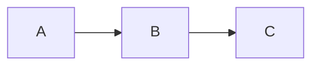
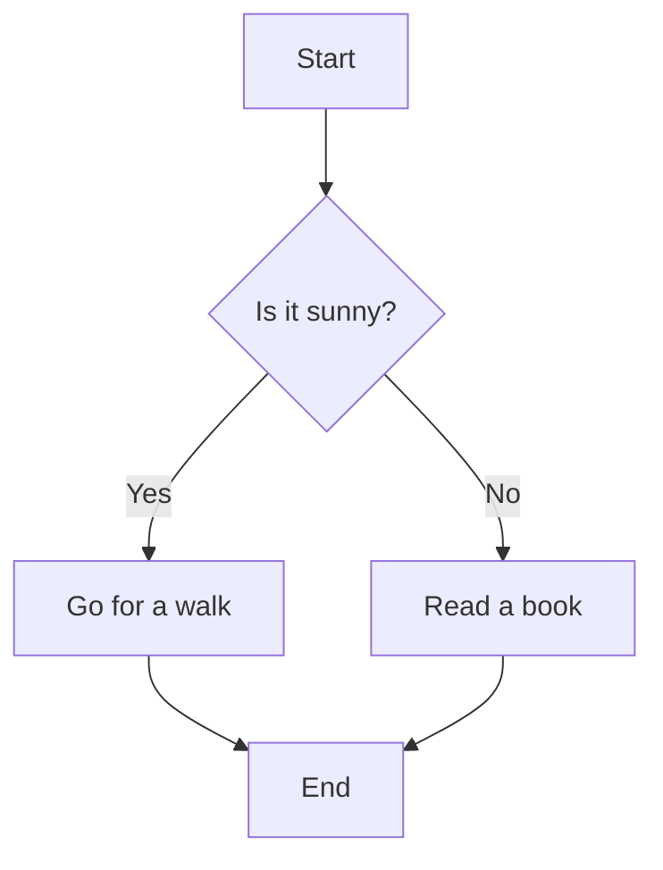
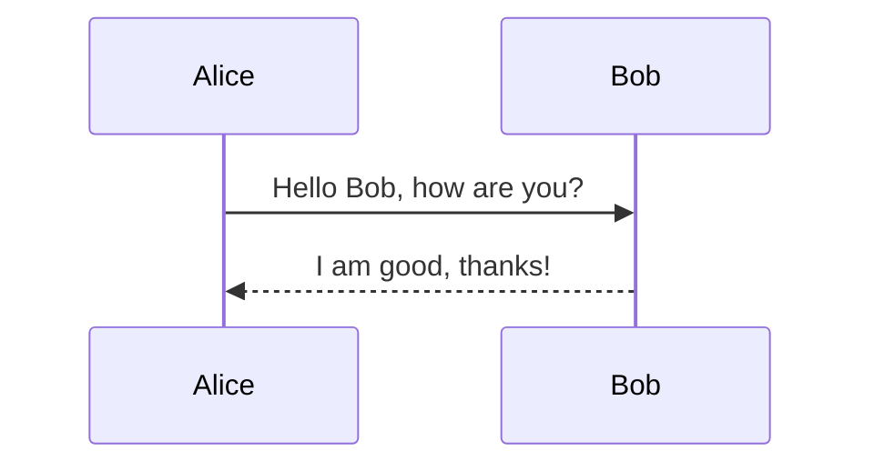
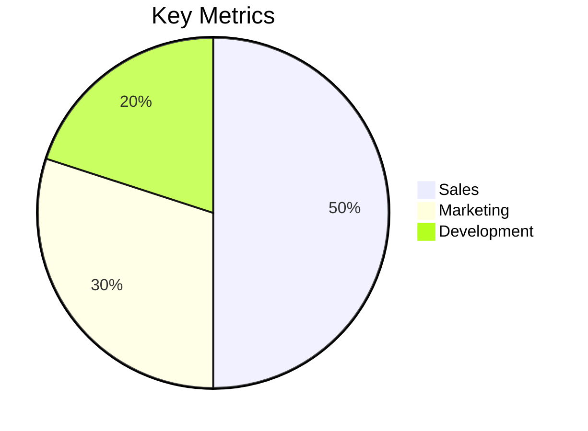
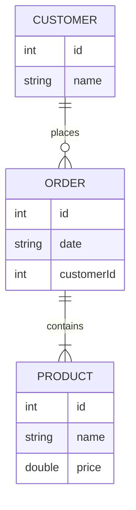
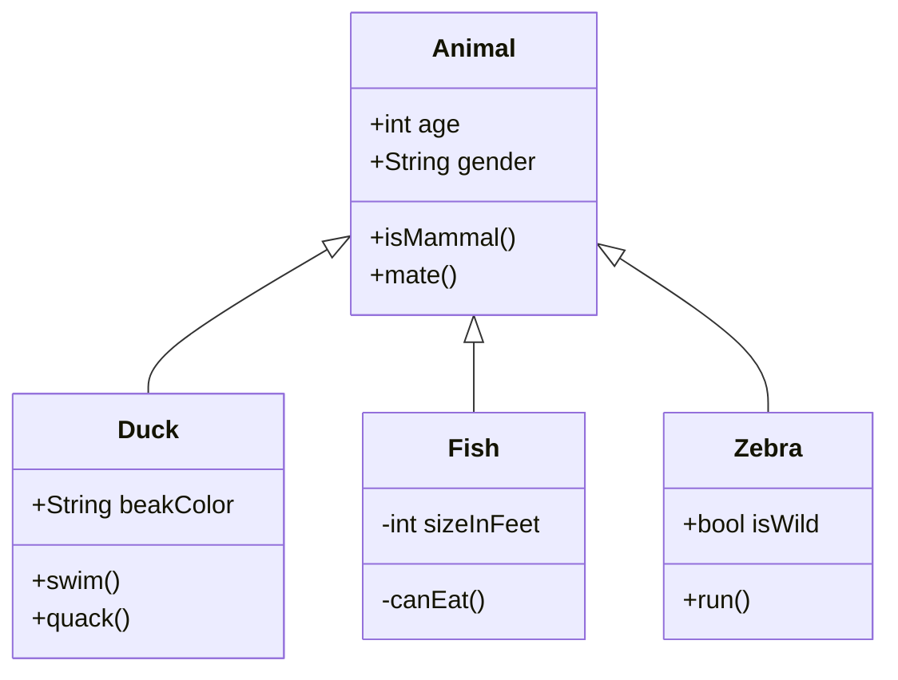
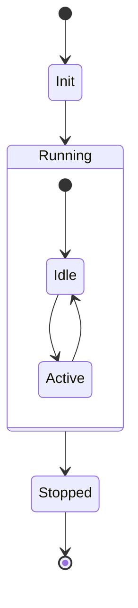
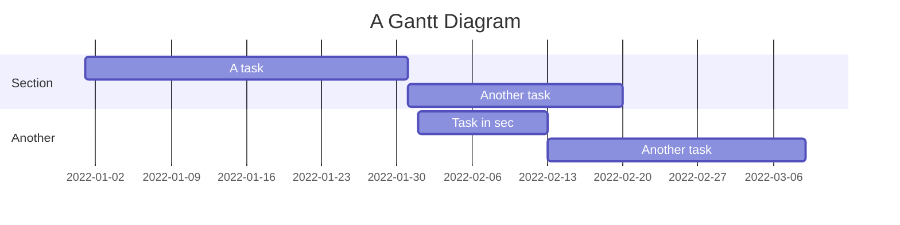
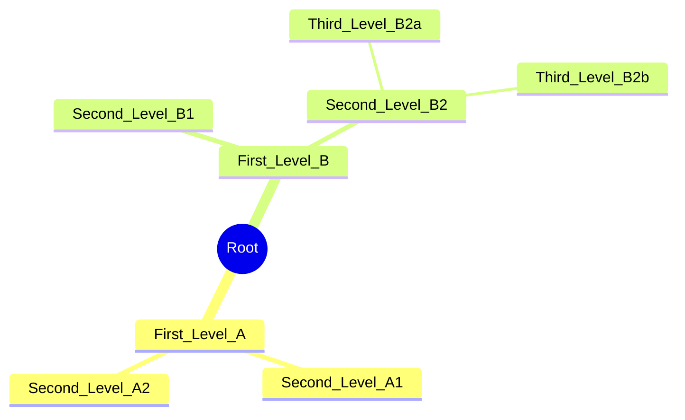
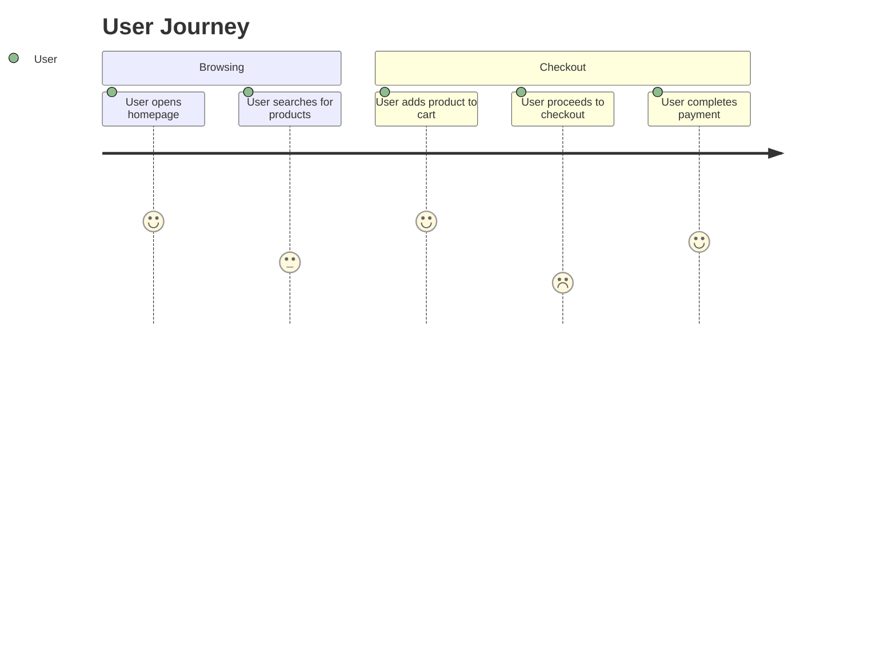

## Table of Contents
- [Code](#code)
- [Tables](#tables)
- [Call Outs](#call-outs)
- [Miscellaneous](#miscellaneous)
- [Charts](#charts)

# Level 1 Heading
## Level 2 Heading
### Level 3 Heading

## Code

Use `code` for inline text.

```json
{
    "software": {
        "name": "Name",
        "version": "1.0",
        "features": ["Feature 1", "Feature 2"]
    }
}
```

```java
public class HelloWorld {
    public static void main(String[] args) {
        System.out.println("Hello, World!");
    }
}
```

```javascript
function greet(name) {
    return `Hello, ${name}!`;
}
```

## Tables

| *Left-Aligned* | Center-Aligned | Right-Aligned |
|:---------------|:--------------:|--------------:|
| Item 1         |     Item 2     |       Item 3  |
| Item 4         |     Item 5     |       Item 6  |

|                | Header 1   | Header 2   |
| -------------- | ---------- | ---------- |
| **Subheader 1**| Content    | Content    |
| **Subheader 2**| Content    | Content    |


<table>
  <tr>
    <th>Header 1</th>
    <th colspan="2">Header 2</th>
  </tr>
  <tr>
    <td>Content 1</td>
    <td>Content 2</td>
    <td>Content 3</td>
  </tr>
</table>

## Call Outs

> [!NOTE]
> Remember to always save your progress before closing the application.

> [!TIP]
> Use keyboard shortcuts to boost your productivity while working.

> [!IMPORTANT]
> Make sure to regularly back up your data to avoid loss.

> [!WARNING]
> Avoid turning off your computer during updates to prevent system corruption.

> [!CAUTION]
> Be cautious when sharing personal information online; protect your privacy.

## Miscellaneous

### Links

- [Documents](https://documents.example.com)

### Collapsible Sections

<details>
  <summary>Click to expand</summary>
  <p>This content is hidden until you click the summary.</p>
</details>

<details>
  <summary>List of Items</summary>
  <ul>
    <li>Item 1</li>
    <li>Item 2</li>
    <li>Item 3</li>
  </ul>
</details>

### Tasks

- [ ] Incomplete item
    - [x] Completed subitem
    - [ ] Incomplete subitem


### Keyboards Inputs

Press <kbd>Ctrl</kbd> + <kbd>C</kbd> to copy.

---

## Charts

### Flowchart






### Sequence Diagram



### Pie Chart



### Entity-Relationship Diagram (ERD)



### Class Diagram



### State Diagram




### Gantt Chart



### Mind Map


### User Journey Diagram

